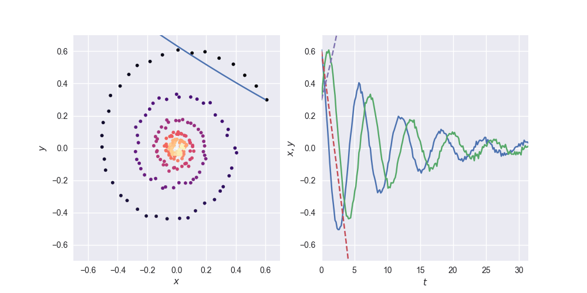
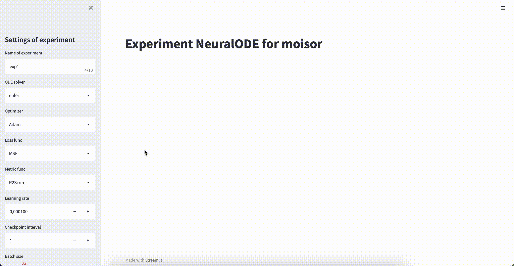

# Имплементация NeuralODE для задачи прогнозирования ЗПВ верхних слоев почвы

Проект представляет из себя исправление `torchdiffreq` для задачи вида
```
dy/dt = f(t, y, v)    y(t_0, v_0) = y_0
```
## Тест
Пока можно только проверить работу самой библиотеки на написанном скрипте. Для этого
1. Выполнить установку __poetry__ через ```pip install poetry```
2. В корневой папке проекта ```poetry install```
3. ```poetry run python src/testODE.py -n test```

Если хочется настроить другие параметры, выполнить ```poetry run python src/testODE.py -h```

Пример работы скрипта:
<p align="center">

</p>

## Запуск с GUI
Возможен только запуск через __poetry__. Для этого (если не запускали тест)
1. Выполнить установку __poetry__ через ```pip install poetry```
2. В корневой папке проекта ```poetry install```
И далее
3. ```poetry run streamlit run src/gui_experiment_1.py```

Далее в браузере откроется следующего вида окно
<p align="center">

</p>

Далее необходимо выставить настройки и нажать __Start running__.

## Стандартный запуск из терминала
Возможен только запуск через __poetry__. Для этого (если не запускали тест)
1. Выполнить установку __poetry__ через ```pip install poetry```
2. В корневой папке проекта ```poetry install```
И далее
3. ```poetry run streamlit run src/experiment_1.py -n exp_name```

Чтобы узнать о параметрах скрипта, выполнить ```poetry run streamlit run src/experiment_1.py -n exp_name -h```


Примечания:
- Все побочные файлы (графики, таблицы с метриками, модель) сохраняются в папку `assets/exp_name` (именную папку эксперимента)
- Все логи пишутся в `logs/exp_name.log` файл
